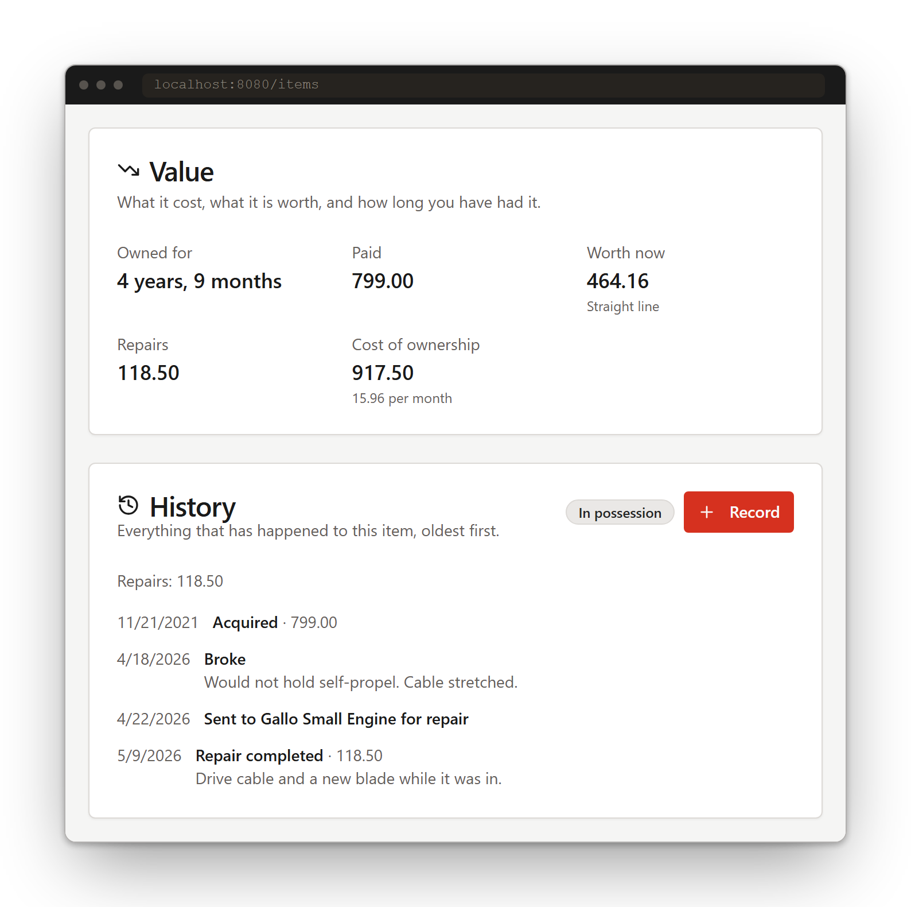
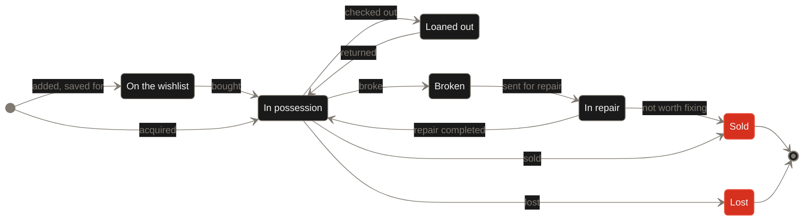
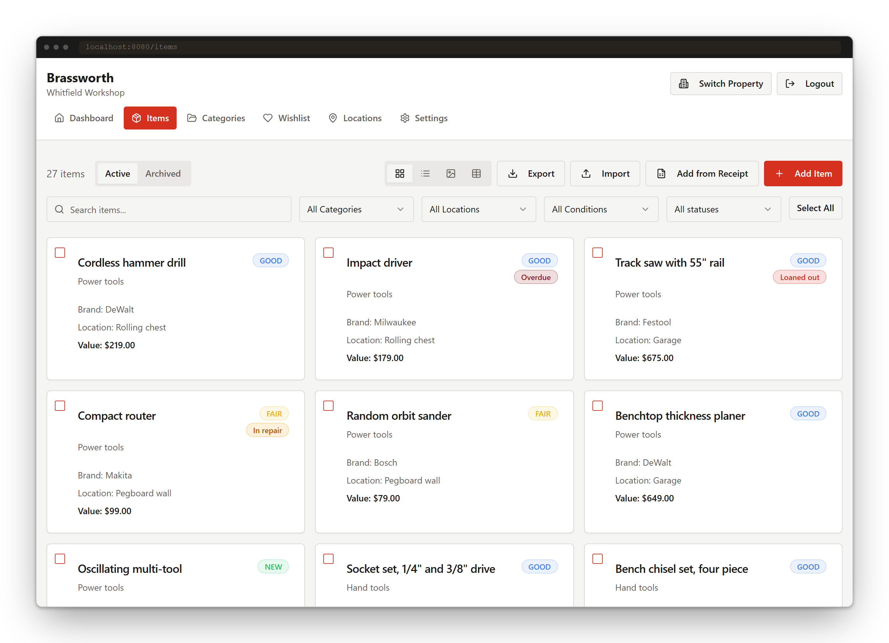
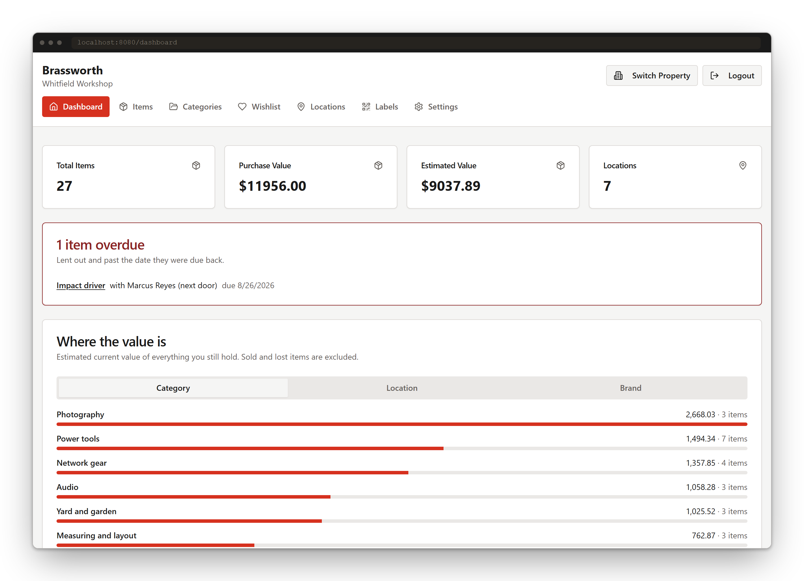
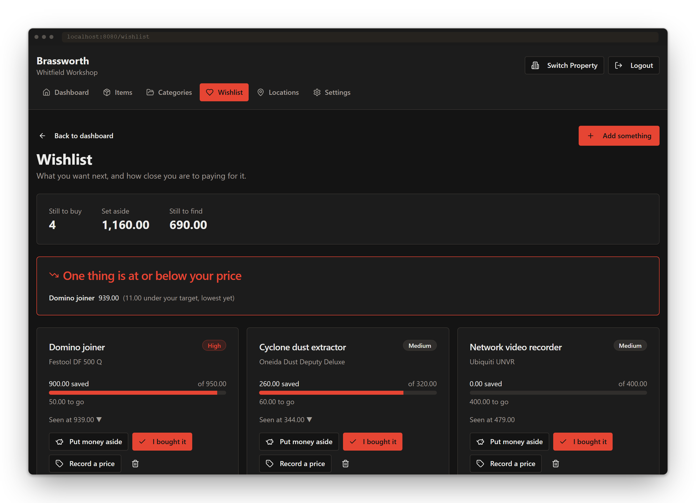
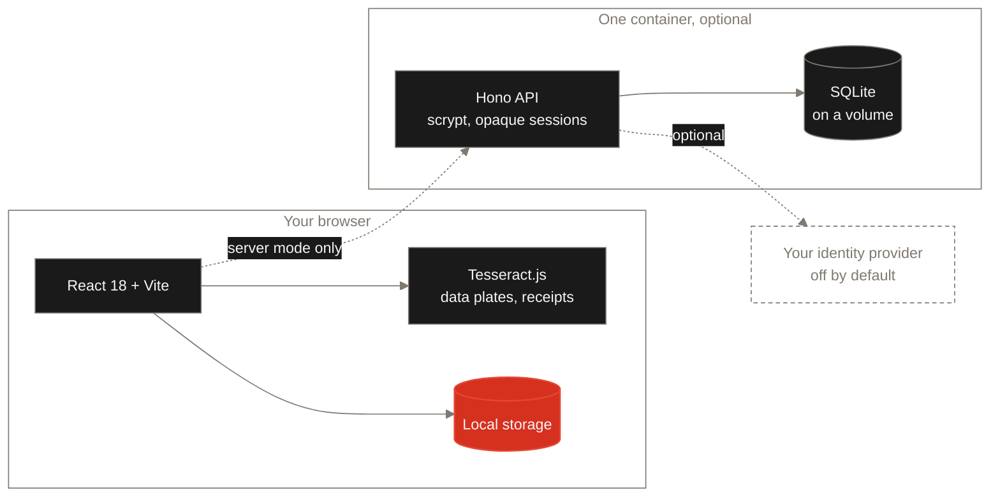

<div align="center">

<picture>
  <source media="(prefers-color-scheme: dark)" srcset="docs/assets/brand/brassworth-mark-dark.svg">
  
</picture>

# Brassworth

**Wanted, bought, lent, broken, repaired, sold.<br>The whole life of everything you own.**

[](./LICENSE) [](https://github.com/24Skater/brassworth/actions)   [](https://github.com/24Skater/brassworth/releases)

[](./docs/ARCHITECTURE.md) [](./docs/SELF_HOSTING.md)  

[Try it](#try-it-in-about-a-minute) · [What it does](#what-it-does) · [Host it](./docs/SELF_HOSTING.md) · [Docs](./docs/INDEX.md) · [Caveats](#before-you-rely-on-it) · [Contribute](./CONTRIBUTING.md)

<picture>
  <source media="(prefers-color-scheme: dark)" srcset="docs/assets/screenshots/demo-dark.gif">
  
</picture>

</div>

---

## Why this exists

You know roughly what is in the garage. What you do not know is who has the impact
driver, what the switch in the rack actually cost you after two repairs, or whether
the camera body is still worth insuring at the number you wrote down four years ago.

Inventory apps answer _what do I have right now_. Brassworth answers **what happened
to this thing, and what is it worth now** — and derives what you own, where it is and
what it is worth from a record you cannot silently overwrite, rather than from a field
you forgot to update.

<div align="center">

<picture>
  <source media="(prefers-color-scheme: dark)" srcset="docs/assets/screenshots/timeline-dark.png">
  
</picture>

<sub>One item, its whole arc. This is the part no other inventory app has.</sub>

</div>

---

## The arc

Every item moves through this, and every move is an entry in an append-only log.
Status is **derived** from that log, never stored on the item — so a mistake is
corrected by adding an entry, not by rewriting history.



---

## What it does

<table>
<tr>
<td width="56" align="center" valign="top">

</td>
<td valign="top">
<b>Your catalogue</b><br>
Brand, model, serial number, category, location, condition, quantity and photos — across as many properties as you keep gear in. Grid, list, gallery and table views, with search, filters and bulk edit.
</td>
</tr>
<tr>
<td width="56" align="center" valign="top">

</td>
<td valign="top">
<b>Check out, check in</b><br>
Hand something over with a name and a date it is due back. See what is overdue without asking anyone.
</td>
</tr>
<tr>
<td width="56" align="center" valign="top">

</td>
<td valign="top">
<b>What it cost you</b><br>
Straight-line or declining-balance depreciation, age of ownership, and total repair spend — so the real cost of a thing is a number, not a feeling.
</td>
</tr>
<tr>
<td width="56" align="center" valign="top">

</td>
<td valign="top">
<b>Worth on paper</b><br>
Value broken down by category, location and brand, exported as clean CSV for your insurer or your accountant.
</td>
</tr>
<tr>
<td width="56" align="center" valign="top">

</td>
<td valign="top">
<b>Before you own it</b><br>
A wishlist with a savings log. Money set aside is recorded entry by entry, and the record carries across when the thing becomes yours.
</td>
</tr>
<tr>
<td width="56" align="center" valign="top">

</td>
<td valign="top">
<b>Watch the price</b><br>
Record what you see something selling for. Brassworth keeps the whole series and tells you when it is at or below your target — not every time it wobbles. Prices are entered by hand today; see <a href="#before-you-rely-on-it">automatic checking</a>.
</td>
</tr>
<tr>
<td width="56" align="center" valign="top">

</td>
<td valign="top">
<b>Know the model</b><br>
Link an item to a gear profile from the bundled community catalogue, so correcting one spec fixes every item that shares the model.
</td>
</tr>
<tr>
<td width="56" align="center" valign="top">

</td>
<td valign="top">
<b>Capture instead of typing</b><br>
Photograph a data plate to pull make, model and serial. Scan a receipt to fill in the purchase. Import and export Excel.
</td>
</tr>
<tr>
<td width="56" align="center" valign="top">

</td>
<td valign="top">
<b>Your data, portable</b><br>
A versioned JSON backup covering every collection. It is also how you move from local-first to a server without retyping anything.
</td>
</tr>
<tr>
<td width="56" align="center" valign="top">

</td>
<td valign="top">
<b>Local-first by default</b><br>
No server, no account, nothing uploaded. Your browser holds it all — <a href="./docs/ARCHITECTURE.md">by design</a>, and that is not going away.
</td>
</tr>
<tr>
<td width="56" align="center" valign="top">

</td>
<td valign="top">
<b>One container when you need more</b><br>
Real accounts with a real security boundary, SQLite on a volume, no external database. Optional sign-in through your own identity provider.
</td>
</tr>
<tr>
<td width="56" align="center" valign="top">

</td>
<td valign="top">
<b>Roles that actually hold</b><br>
Four roles across ten permissions. In server mode they are checked on every request — not just used to decide which buttons to draw.
</td>
</tr>
</table>

<details>
<summary><b>How it compares</b></summary>

<br>

|                                               | Brassworth | HomeBox | Snipe-IT |   Sortly   | ShareMyToolbox |
| --------------------------------------------- | :--------: | :-----: | :------: | :--------: | :------------: |
| Custody log: who has it, when it is due back  |    Yes     |  Basic  |   Yes    | Paid tiers |      Yes       |
| Breakage, repair cost and repair history      |    Yes     |   No    | Limited  |     No     |       No       |
| Depreciation and cost of ownership            |    Yes     |   No    |   Yes    |     No     |       No       |
| Pre-purchase: wishlist, savings, price alerts |    Yes     |   No    |    No    |     No     |       No       |
| Runs with no server, nothing uploaded         |    Yes     |   No    |    No    |     No     |       No       |
| Licence                                       |    MIT     |  AGPL   |   AGPL   |    Paid    |      Paid      |

**Use something else if:** you need native mobile apps today — Sortly's are far better
than our browser app. You are managing thousands of assets with barcode label printers
and scheduled audits — that is Snipe-IT, and it has a decade on us. You want the
smallest possible self-hosted home inventory and nothing more — HomeBox is excellent at
exactly that.

</details>

---

## A look at it

<div align="center">

<picture>
  <source media="(prefers-color-scheme: dark)" srcset="docs/assets/screenshots/items-dark.png">
  
</picture>

<sub><b>Status and condition are separate axes.</b> A drill can be in good condition <i>and</i> lent to your neighbour.</sub>

<br><br>

<table>
<tr>
<td width="50%" align="center"><br><sub>Workshop light</sub></td>
<td width="50%" align="center"><br><sub>Workshop dark</sub></td>
</tr>
</table>

</div>

---

## Try it in about a minute

No account, no server, nothing uploaded.

**Requires** Node.js 20 or newer. The container image builds on Node 22; CI runs Node 20.

```bash
git clone https://github.com/24Skater/brassworth.git
cd brassworth && npm install && npm run dev
```

Open **http://localhost:8080** and add the first thing you own.

Want a real security boundary instead of browser storage?

```bash
docker compose up -d
```

Open **http://localhost:3000**. One container, SQLite on a volume, no external
database. Full walkthrough in [SELF_HOSTING.md](./docs/SELF_HOSTING.md).

### Two ways to run it

<table>
<tr>
<td width="56" align="center" valign="top"></td>
<td valign="top">
<b>Local-first</b> — the default<br>
Everything lives in your browser. No server to run, no account to create, nothing
leaves the machine. Best for one person tracking their own gear.
</td>
</tr>
<tr>
<td width="56" align="center" valign="top"></td>
<td valign="top">
<b>Self-hosted server</b><br>
Real accounts with passwords hashed using scrypt, opaque session tokens in httpOnly
cookies, and roles enforced server-side on every request. Choose this when the data
matters more than the convenience of having no server at all.
</td>
</tr>
</table>

---

## Before you rely on it

**Local-first mode has no server, and its sign-in screen is not a security boundary.**
Accounts, roles and passwords are records in your browser's storage. Anyone who can
open that browser can read or change them. Treat local-first mode as a single-user
application on a machine you control — it is designed for privacy, not for keeping
other people out.

**Run the server when the data matters.** In server mode, roles are enforced on every
request, passwords are hashed with scrypt, sessions are httpOnly cookies, and optional
OIDC sign-in is off unless you configure it.

**Sharing a property with a second person is not usable yet.** The permission model is
built and enforced, but server mode has no route to add another member to a property —
inviting reports itself as unavailable. Multi-user works in local-first mode, where it
is not a security boundary. Until that route lands, treat server mode as single-user
with a real boundary rather than a way to share gear with a crew.

**Automatic price checking is not connected.** The checker is written and tested — it
reads published product data only, never scrapes rendered pages, honours `robots.txt`,
throttles per host and refuses anything but https — but no route calls it yet, and
`PRICE_WATCH_ENABLED` currently does nothing. Prices you record by hand work fully.

**Export your data.** Both modes ship a full versioned JSON backup covering every
collection. In local-first mode, clearing site data deletes everything, and there is no
copy anywhere else. See [BACKUP.md](./docs/BACKUP.md).

**The hosted service does not exist yet.** `app.brassworth.com` is the next milestone.
Today there is the code in this repository and nothing else.

---

## How it works



The app talks to a **storage provider** and an **auth provider** behind two interfaces.
Local-first mode binds them to browser storage; server mode binds them to the API. The
same screens run over both, which is why local-first can stay a first-class mode rather
than a demo. See [ARCHITECTURE.md](./docs/ARCHITECTURE.md).

<details>
<summary><b>Configuration</b></summary>

<br>

**Browser app** — set in `.env`, read at build time.

| Variable                             | Default            | What it does                                    |
| ------------------------------------ | ------------------ | ----------------------------------------------- |
| `VITE_STORAGE_PROVIDER`              | `localStorage`     | `localStorage`, `indexeddb`, or `api`           |
| `VITE_API_BASE_URL`                  | `''` (same origin) | Where the API lives, when the provider is `api` |
| `VITE_SESSION_EXPIRY_HOURS_SHORT`    | `24`               | Session length without "remember me"            |
| `VITE_SESSION_EXPIRY_HOURS_REMEMBER` | `720`              | Session length with "remember me"               |

**Server** — set in the container environment.

| Variable                        | Required | Default | What it does                                                                                    |
| ------------------------------- | :------: | ------- | ----------------------------------------------------------------------------------------------- |
| `DATABASE_URL`                  |   Yes    | —       | libSQL URL, e.g. `file:/app/data/brassworth.db`                                                 |
| `PORT`                          |    No    | `3000`  | Port the server listens on                                                                      |
| `NODE_ENV`                      |    No    | —       | `production` marks the session cookie `Secure`                                                  |
| `SESSION_TTL_HOURS`             |    No    | `168`   | How long a session lasts                                                                        |
| `STATIC_ROOT`                   |    No    | `dist`  | Directory the built app is served from                                                          |
| `PRICE_WATCH_ENABLED`           |    No    | off     | Reserved for automatic price checking. Reachable by no route today, so setting it has no effect |
| `OIDC_ISSUER`                   |    No    | —       | Identity provider. All six `OIDC_*` are needed together                                         |
| `OIDC_CLIENT_ID`                |    No    | —       |                                                                                                 |
| `OIDC_CLIENT_SECRET`            |    No    | —       |                                                                                                 |
| `OIDC_REDIRECT_URI`             |    No    | —       |                                                                                                 |
| `OIDC_LABEL`                    |    No    | —       | Text on the sign-in button                                                                      |
| `OIDC_PROVIDER`                 |    No    | —       | Provider hint                                                                                   |
| `GEAR_CATALOGUE_URL`            |    No    | —       | An external gear catalogue source                                                               |
| `GEAR_CATALOGUE_NAME`           |    No    | —       | How that source is credited                                                                     |
| `GEAR_CATALOGUE_API_KEY`        |    No    | —       |                                                                                                 |
| `GEAR_CATALOGUE_API_KEY_HEADER` |    No    | —       |                                                                                                 |
| `GEAR_CATALOGUE_API_KEY_FORMAT` |    No    | —       |                                                                                                 |

Full reference and the reasoning behind each in
[SELF_HOSTING.md](./docs/SELF_HOSTING.md).

</details>

---

## Documentation

<table>
<tr>
<td width="40" align="center" valign="top"></td>
<td valign="top"><a href="./docs/INDEX.md"><b>Documentation index</b></a><br>Every document, and who each one is for.</td>
</tr>
<tr>
<td width="40" align="center" valign="top"></td>
<td valign="top"><a href="./docs/GETTING_STARTED.md"><b>Getting started</b></a><br>From zero to your first tracked item, in either mode.</td>
</tr>
<tr>
<td width="40" align="center" valign="top"></td>
<td valign="top"><a href="./docs/SELF_HOSTING.md"><b>Self-hosting</b></a><br>The container, the volume, every variable, HTTPS, upgrades.</td>
</tr>
<tr>
<td width="40" align="center" valign="top"></td>
<td valign="top"><a href="./docs/BACKUP.md"><b>Backup and restore</b></a><br>Keeping your data, and moving it between modes.</td>
</tr>
<tr>
<td width="40" align="center" valign="top"></td>
<td valign="top"><a href="./docs/ARCHITECTURE.md"><b>Architecture</b></a><br>How it is put together, and which alternatives were rejected.</td>
</tr>
<tr>
<td width="40" align="center" valign="top"></td>
<td valign="top"><a href="./CONTRIBUTING.md"><b>Contributing</b></a><br>Setup, the commit rules, and the checks a pull request must pass.</td>
</tr>
</table>

---

## Contributing

Pull requests are welcome. The one hard rule: **no pull request without a passing test
that covers the change.** Six checks must pass before you open one — see
[TESTING.md](./docs/TESTING.md).

```bash
npm install
npm run lint && npm run type-check && npm run test:coverage && npm run build
```

Read [CONTRIBUTING.md](./CONTRIBUTING.md) first — commit messages are linted against a
fixed list of types and scopes, and a message outside it is rejected by the hook.

Security issues go to [SECURITY.md](./SECURITY.md), not the issue tracker.

## License

[MIT](./LICENSE). The bundled gear catalogue is separately licensed under ODbL 1.0 and
DbCL 1.0 — see [CATALOGUE.md](./docs/CATALOGUE.md).
