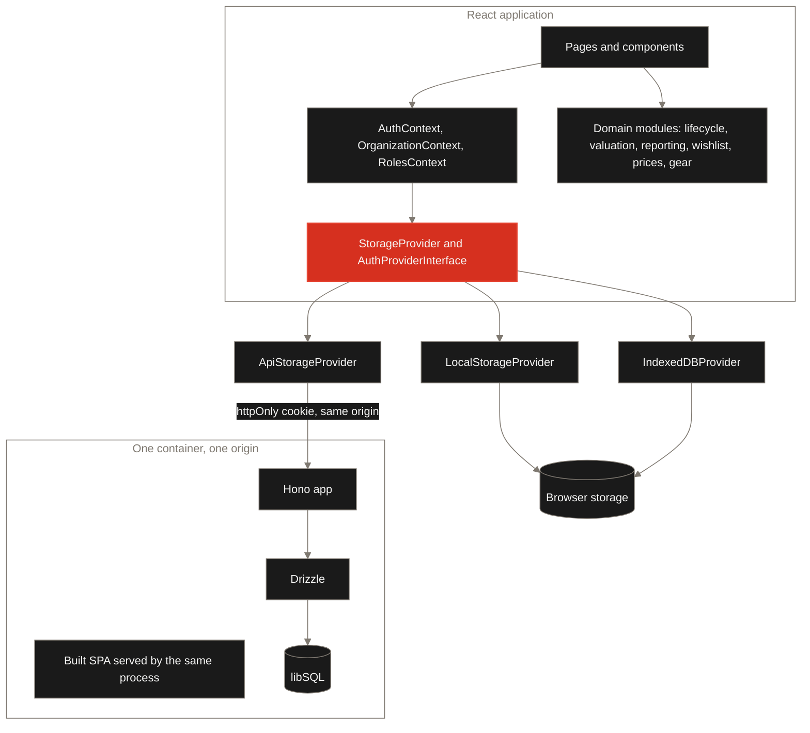
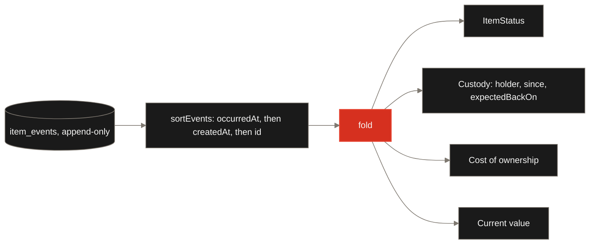
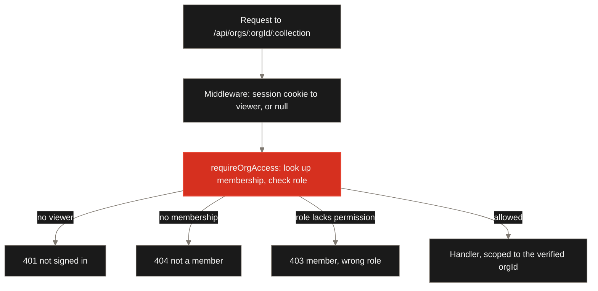

# Architecture

How Brassworth is put together, and which alternatives were rejected on the way. This
document explains reasoning. The tables and fields live in [Data model](./DATA_MODEL.md),
the HTTP contract lives in [API](./API.md), the environment variables live in
[Self-hosting](./SELF_HOSTING.md), and the provider seams live in
[Extending](./EXTENDING.md). Nothing here restates them.

## Contents

1. [The shape of the thing](#the-shape-of-the-thing)
2. [Two shapes, one codebase](#two-shapes-one-codebase)
3. [The event-sourced core](#the-event-sourced-core)
4. [Domain modules](#domain-modules)
5. [The provider seam](#the-provider-seam)
6. [The server](#the-server)
7. [Identity](#identity)
8. [Tenancy and authorisation](#tenancy-and-authorisation)
9. [The frontend](#the-frontend)
10. [Decisions and rejected alternatives](#decisions-and-rejected-alternatives)
11. [Where things live](#where-things-live)

## The shape of the thing

Brassworth catalogues physical possessions and follows them from the moment you want one
to the moment you sell it. React 18 with Vite and TypeScript on the front, shadcn
components over Radix primitives, Tailwind for styling, TanStack Query v5 for server state
and React Router for navigation. The server is Hono, Drizzle and libSQL, in the same
language, sharing the same types.

Two properties shape everything else:

- **The lifecycle is an append-only log.** Nothing about an item's status is stored. It is
  computed by folding events, every time.
- **Storage is an interface with three implementations.** The same application code runs
  entirely in a browser with no server at all, or against an API. That is not a migration
  path with a demo tier at the near end. Both ends are supported destinations.

## Two shapes, one codebase



`VITE_STORAGE_PROVIDER` picks the branch at build time. The default is
`localStorage`; `indexeddb` and `api` are opt-in. Everything above the seam is identical
in all three.

### Local-only mode is permanent

Running with no server is the privacy claim. It is the reason the project is worth
open-sourcing, and it is why the storage interface exists at all rather than being a
thin wrapper over `fetch`. It does not get deprecated once the hosted tier matures.

The cost is real and worth stating plainly: in local-only mode every authorisation check
runs in the browser, which means it is advice rather than a control. Anyone with developer
tools can edit their own role. That is acceptable when the data never leaves the machine
and the "tenant" is one person, and it is exactly the confusion the API tier exists to end.
[Security](../SECURITY.md) sets out what each mode does and does not protect.

## The event-sourced core

This is the part of Brassworth worth understanding first, because everything else follows
from it.

An item does not have a status column. It has a list of events. `item_events` is
append-only: nothing is ever updated in place and nothing is deleted except when the item
itself goes. Status, custody, cost and current value are all pure functions of that list.



Eleven event types exist. Eight move an item through its life
(`ACQUIRED`, `LOANED_OUT`, `RETURNED`, `BROKE`, `SENT_FOR_REPAIR`, `REPAIR_COMPLETED`,
`SOLD`, `LOST`) and three record information without moving it (`MOVED`,
`VALUE_REASSESSED`, `NOTE`). `SOLD` and `LOST` are terminal: later events are still
recorded and still shown on the timeline, but they cannot bring an item back.

Three details in [`src/lib/lifecycle/index.ts`](../src/lib/lifecycle/index.ts) are worth
knowing:

- **Two timestamps, deliberately.** `occurredAt` is when the thing happened in the real
  world and is what orders the timeline. `createdAt` is when it was recorded. They differ
  whenever somebody backdates, and backdating a loan and its return to the same day is
  ordinary, so `createdAt` breaks the tie and `id` breaks that tie in turn. The sort is
  total, so the fold is deterministic.
- **No events means owned, not unknown.** The log was introduced after items already
  existed. An empty list therefore means "nothing has happened yet".
- **Nothing reads the ambient clock.** Every function that needs "now" takes it as an
  argument. That is what makes the money arithmetic exhaustively testable rather than
  testable-on-a-good-day.

The same pattern appears twice more. Savings contributions against a wishlist entry are
append-only, and a withdrawal is a negative contribution rather than an edit. Price
observations are append-only, because a single latest price cannot answer "is this
actually a good deal or just what it always costs", which is the question a price alert is
really being asked.

**Rejected: storing the status and updating it on write.** It is one column and one
`UPDATE` and it is faster to read. It is also two sources of truth from the moment it
exists. Every future path that appends an event has to remember to update the column, and
the one that forgets produces an item that reads as in-possession while its log says it
was sold. Denormalising invites dual-write bugs, and the read it saves is a fold over a
list that is almost always shorter than twenty entries. If that ever stops being true, a
cache is a change to one function; unwinding a stored status is a change to every writer.

A second consequence: **corrections are appends.** A mistyped loan is fixed by appending
the event that puts it right, not by rewriting history. That is what makes "what happened
to this thing" answerable at all.

## Domain modules

Six modules under `src/lib/` hold the rules. All of them are pure functions over data
passed in, none of them reads storage, and none of them imports React. That is a
deliberate boundary: the rules that matter are the ones that must not drift, and a pure
function is the only kind that can be pinned down by a test.

| Module      | Lives in                                             | What it decides                                             |
| ----------- | ---------------------------------------------------- | ----------------------------------------------------------- |
| `lifecycle` | [`src/lib/lifecycle`](../src/lib/lifecycle/index.ts) | Status, custody and cost, folded from the event log         |
| `valuation` | [`src/lib/valuation`](../src/lib/valuation/index.ts) | What something is worth now, and how long it has been owned |
| `reporting` | [`src/lib/reporting`](../src/lib/reporting/index.ts) | Aggregation by category, location and brand                 |
| `wishlist`  | [`src/lib/wishlist`](../src/lib/wishlist/index.ts)   | Savings progress against a target                           |
| `prices`    | [`src/lib/prices`](../src/lib/prices/index.ts)       | Reading a price series: latest, lowest, highest             |
| `gear`      | [`src/lib/gear`](../src/lib/gear/index.ts)           | Matching an item to a make and model                        |

Two of these carry decisions worth naming.

**Reporting treats brand as a field, not an architecture.** The same breakdown machinery
serves category, location and brand, because those differ only in how a row is keyed. That
is why hand tools, IT equipment and AV gear report identically without a line of code
knowing which is which.

**The gear catalogue is merged at read time and never written.** A JSON file of makes and
models ships with the app. Persisting it would copy a read-only dataset into every
tenant's storage, bloat every backup with data that is not the user's, and turn a
catalogue update into a migration. Only profiles somebody wrote themselves are stored.
Because of that, a catalogue profile's id is _derived_ from its make and model rather than
assigned, so an item's link survives the catalogue being updated, reordered or replaced.
The full story, including the ODbL licensing, is in [Catalogue](./CATALOGUE.md).

Two more subsystems sit on the server rather than in the browser, both off unless
configured. An optional vendor catalogue source exists because a browser cannot hold an
API key: anything the client can send, a user can read out of the bundle. And a price
checker in [`server/prices`](../server/prices/checker.ts) that obeys `robots.txt`, throttles
per host, reads only structured data rather than rendered HTML, and caps both time and
response size. It is a library today, gated behind `PRICE_WATCH_ENABLED`, and no route or
scheduler invokes it yet. The app must not start making requests to somebody else's
service merely because it was installed.

## The provider seam

Storage is an interface. Three classes implement it, and a factory in
[`src/lib/storage/index.ts`](../src/lib/storage/index.ts) picks one from
`VITE_STORAGE_PROVIDER`.

| Provider               | Backing                                                             | Status                                          |
| ---------------------- | ------------------------------------------------------------------- | ----------------------------------------------- |
| `LocalStorageProvider` | `window.localStorage`                                               | The default                                     |
| `IndexedDBProvider`    | Dexie over IndexedDB, database `HomeAssetKeeperDB`, schema v1 to v5 | Opt-in; migrates from localStorage on first use |
| `ApiStorageProvider`   | The Hono API over `fetch`                                           | What the Docker image runs                      |

Auth mirrors it, and **one variable switches both**. Setting `VITE_STORAGE_PROVIDER=api`
selects `ApiAuthProvider` as well as `ApiStorageProvider`. That coupling is deliberate and
[`src/lib/auth/index.ts`](../src/lib/auth/index.ts) says why: pairing browser-side auth
with server-side storage would mean the client asserting an identity the server never
checked. There is no configuration that produces that combination, because there is no
configuration in which it is correct.

The mechanics of implementing either interface are in [Extending](./EXTENDING.md).

## The server

`server/` sits beside `src/` with its own `tsconfig`, sharing types from `src/types`.

**Rejected: restructuring into a workspace monorepo.** It would touch every import path,
the CI config and the Docker build, to buy isolation a solo pre-1.0 project does not need
yet. Two directories and two tsconfigs is the smaller thing that works.

### Same origin, one container

The built SPA is served statically by the same Node process that serves the API. Requests
that are not `/api/*` and not a real file get the shell back, so client-side routing
works on a hard refresh.

This is not a packaging convenience. Same origin means there is **no CORS surface at all**,
and the session cookie needs no cross-site configuration to work. A self-hoster runs one
container rather than wiring a reverse proxy between two.

**Rejected: separate frontend and API containers.** It is the conventional shape and it
buys independent scaling that nobody self-hosting an inventory app needs. It costs a CORS
configuration, a `SameSite=None` cookie, and a class of "it works locally but not behind
my proxy" support burden.

### Schema creation

[`server/db/index.ts`](../server/db/index.ts) runs hand-written, idempotent DDL on
startup: `CREATE TABLE IF NOT EXISTS`, `CREATE INDEX IF NOT EXISTS`, and an
`addColumnIfMissing` helper that inspects `PRAGMA table_info` before altering, because
`CREATE TABLE IF NOT EXISTS` does nothing to a table that already exists.
`PRAGMA foreign_keys = ON` is set explicitly, since SQLite does not enforce them by
default.

**Rejected: running drizzle-kit at runtime.** Generated migrations are the right answer
once the schema changes under real users, and this becomes a migrations directory then.
Before the first release it would mean shipping a build-time tool into the runtime image
so it could replay a migration history with exactly one entry in it. Drizzle still owns
the schema definition and the query builder; it just does not own table creation yet.

### Generic collection routing

Eleven tenant-scoped collections behave identically over the wire: list, create, update,
delete, replace. [`server/routes/collections.ts`](../server/routes/collections.ts)
describes each one once, as a table, a Zod schema and the permissions it needs, and a
single generic router in `server/app.ts` serves all of them.

The reason is not brevity. Eleven near-identical route sets would be eleven places the
authorisation guard could be forgotten, and forgetting it once is a tenant data leak. One
router means the guard is applied in exactly one place. The routes themselves are
documented in [API](./API.md).

## Identity

There are two authentication implementations because there are two deployment shapes, and
they are not variations on a theme.

### In the browser, with no server

PBKDF2-SHA256, 100,000 iterations, a 16-byte random salt per user, compared in constant
time. Accounts created before salting used a bare SHA-256 digest; those are detected on
login, verified against the old scheme, and rehashed into the new one on the next
successful sign-in, so nobody is locked out and nobody stays on the weak hash.

Login rate limiting lives in [`src/lib/auth/rateLimiter.ts`](../src/lib/auth/rateLimiter.ts):
five attempts, then escalating lockouts of one minute, five, fifteen and an hour, persisted
in IndexedDB so closing the tab does not clear them. Sessions expire after 24 hours, or 30
days when "remember me" is ticked.

None of this is a server credential and none of it defends against the person sitting at
the machine. It defends against someone else picking up an unlocked laptop, which is the
threat that actually exists in this mode.

### Against the server

**scrypt, N=2^17, r=8, p=1**, from Node's own `crypto`. Hashes are self-describing, so the
parameters can be raised later without stranding anyone.

_Rejected: Argon2id._ It is the stronger first choice on paper. Every Node binding for it
is a native module, and this project's pitch to self-hosters is that running it is easy.
scrypt is OWASP's named second choice, is memory-hard, and ships in the standard library:
no compiler, no prebuilt-binary roulette on somebody's NAS. The parameters follow the
OWASP cheat sheet.

The browser's PBKDF2 hashes cannot be migrated to the server. They were never a server
credential. Local accounts re-register.

**Opaque 256-bit session tokens**, of which only the SHA-256 is stored. A leaked database
therefore does not hand over usable sessions. SHA-256 is correct here and scrypt would be
wrong: the token is entropy we generated, not a secret a human chose, so there is nothing
to slow an attacker down over.

_Rejected: JWTs._ A JWT cannot be revoked without maintaining a denylist, and consulting a
denylist is the same database round-trip a JWT exists to avoid. At that point it is a
session table with extra steps, and it has cost the ability to log someone out.

The token rides in a cookie marked `HttpOnly`, `SameSite=Lax` and `Path=/`. `Secure` is
added only when `NODE_ENV=production`, because marking it `Secure` during local
development over `http://` silently loses the session every request. `HttpOnly` is the
single most important difference from the local tier, where any injected script could take
the session straight out of localStorage.

Login is timing-equalised: a password is hashed against a placeholder even when no account
exists, so a missing account and a wrong password take the same time and neither confirms
whether an address is registered.

### Sign-in through an identity provider

Optional and absent unless configured. `OIDC_ISSUER`, `OIDC_CLIENT_ID`,
`OIDC_CLIENT_SECRET` and `OIDC_REDIRECT_URI` are required together; with any missing, the
routes report themselves unavailable rather than half-enabling.

The flow uses **`openid-client`**. Email and password with server-side sessions is a
well-trodden pattern worth writing out. OAuth is not: the redirect dance, state, nonce and
PKCE all have to be right, and getting one wrong is a login bypass rather than a bug.

_Rejected: hand-rolling it._ See above.

_Rejected: Better Auth._ An earlier draft of this document named it. It was never
installed and is not a dependency. Adopting a full auth framework would have meant taking
its session model, its schema and its migration story wholesale in exchange for a
password hash and a redirect handler, when the parts actually worth outsourcing are the
OIDC flows alone. `openid-client` outsources exactly those and nothing else.

Accounts link by **subject, never by email alone**. An address can change hands, so a
provider that does not verify addresses would otherwise let somebody claim an existing
account by asserting its address. Auto-linking to an existing local account happens only
when the provider marks the address verified; otherwise the attempt is refused and
explained. An account created this way has no password, and the password form says so
rather than returning an "incorrect password" that could never be satisfied.

The short-lived state of an in-flight sign-in is held in memory. It lives for the seconds
between the redirect out and the redirect back, and a restart losing it just means the
person clicks the button again. A table plus a cleanup job to store something disposable
would be worse.

## Tenancy and authorisation

Every domain type carries an `organizationId`. On the server, tenancy is enforced at one
point.



Three things about this are load-bearing.

**The organisation id comes from the path, never the body.** The path segment is what gets
checked, and it is the same value the handler scopes its query to. A client-supplied
`organizationId` in a payload is not trusted, because trusting it is the whole class of
bug this guard exists to prevent.

**Membership and role are looked up server-side on every request.** Not cached in the
session, not asserted by the client. A role changed in one tab takes effect in every
other on the next request.

**A non-member gets 404, not 403.** Telling a stranger "that organisation exists, you just
cannot see it" leaks which properties exist. A member who lacks the specific permission
gets 403, because they already know it exists and the distinction is useful to them.

### The permission matrix is duplicated on purpose

[`src/lib/auth/permissions.ts`](../src/lib/auth/permissions.ts) and
[`server/auth/access.ts`](../server/auth/access.ts) contain the same four roles and the
same ten permissions, and neither imports the other.

They are answering different questions. The browser copy decides what to **show**: which
buttons render, which menu items appear. The server copy decides what is **allowed**.
Sharing one module would invite the assumption that a client-side check is a control,
which is precisely the mistake local-only mode makes by necessity and the API tier exists
to fix. Duplication makes the asymmetry visible in the file layout.

The obvious risk is drift, and it is handled the obvious way: a test in
`tests/server/auth.test.ts` asserts the two matrices are identical, and fails the build if
they are not. The matrix itself is documented in [Data model](./DATA_MODEL.md).

## The frontend

Contexts hold what is genuinely app-wide and nothing else: `AuthContext` for the current
user, `OrganizationContext` for the selected property, `RolesContext` for the current
role. Forms use React Hook Form with Zod resolvers. TanStack Query v5 handles server
state where there is a server. User input that reaches markup passes through DOMPurify.

All twelve pages are route-level `React.lazy` imports behind a single `Suspense`
boundary in `src/App.tsx`, so the initial download is the shell plus one route rather than
the whole application. Vendor code is split into five named chunks in `vite.config.ts`,
which cache independently of application code and of each other.

`ErrorBoundary` and `SkipLink` wrap the app at the root in `src/main.tsx`, above the
router, so a render error anywhere produces a usable screen rather than a blank one, and
the skip link is the first focusable element on every route. axe-core is imported
dynamically and only when `import.meta.env.DEV`, so it reports in the console during
development and is absent from the production bundle entirely.

The seams a contributor would actually reach for, with their real names and limits, are
in [Extending](./EXTENDING.md).

## Decisions and rejected alternatives

A summary. The reasoning for each is in the section above it.

| Decision                                         | Rejected alternative                             | Because                                                                                                                      |
| ------------------------------------------------ | ------------------------------------------------ | ---------------------------------------------------------------------------------------------------------------------------- |
| Status derived by folding events                 | A stored status column                           | Denormalising invites dual-write bugs; a fold over a short list is cheap                                                     |
| Corrections are appends                          | Editing or deleting events                       | An append-only log is the only kind that can answer "what happened"                                                          |
| scrypt for passwords                             | Argon2id                                         | Every Node Argon2 binding is a native module; easy self-hosting is a project value                                           |
| Opaque session tokens                            | JWTs                                             | A JWT cannot be revoked without a denylist, which is a session table with extra steps                                        |
| libSQL                                           | better-sqlite3                                   | No native compilation, and the same driver reaches a hosted database over `libsql://`                                        |
| `openid-client`                                  | Hand-rolled OIDC, or Better Auth                 | PKCE, nonce and state are exactly the code you do not want to write; a full framework brings a session model we already have |
| Hand-written idempotent DDL                      | drizzle-kit at runtime                           | Ships a build tool into the runtime image to replay a one-entry history                                                      |
| One generic collection router                    | Eleven route sets                                | One place to forget the authorisation guard, not eleven                                                                      |
| Duplicated permission matrix, plus a parity test | One shared module                                | The copies answer different questions; sharing implies a client check is a control                                           |
| 404 for non-members                              | 403 everywhere                                   | 403 confirms which properties exist                                                                                          |
| Same-origin single container                     | Separate frontend and API containers             | Removes the CORS surface entirely and halves the operator's work                                                             |
| `server/` beside `src/`                          | A workspace monorepo                             | Touches every path and the whole build to buy isolation nobody needs yet                                                     |
| Catalogue merged at read time                    | Seeding it into every tenant                     | Copies read-only data into every backup and makes updates a migration                                                        |
| Generic gear profiles                            | Vendor-named modules, scraped vendor catalogues  | Brand is a string on a row; no trademark belongs in a directory name                                                         |
| No plugin SDK yet                                | Designing the extension interface now            | An interface designed before its second implementation is a guess                                                            |
| Local-only mode stays                            | Treating it as a demo tier on the way to hosting | It is the privacy claim, and the reason this is worth open-sourcing                                                          |

Two of those deserve a further sentence.

**No plugin SDK until real modules exist.** The optional vendor catalogue source is
deliberately not a per-vendor plugin. It fetches a JSON document in the documented
catalogue format and validates it, which works today with any vendor publishing JSON. An
extension interface designed against one hypothetical consumer encodes that consumer's
shape as though it were general. Three real cases first, then the abstraction they have in
common. [Roadmap](./ROADMAP.md) tracks this.

**Brand is data.** There is no per-vendor module, no registry of supported makes, and no
directory named after anyone's trademark. Adding a manufacturer is adding a row. Matching
handles the fact that `DeWalt`, `DEWALT` and `De Walt` are one brand by normalising both
sides, which is a string function rather than an architecture.

## Where things live

```text
src/
  components/       UI: ui/ is shadcn, common/ is shared, the rest is by feature
  contexts/         AuthContext, OrganizationContext, RolesContext
  hooks/            useDebounce, useThrottle, useMemoizedCallback, use-mobile, use-toast
  lib/
    auth/           Interfaces, the permission matrix, rate limiter, two providers
    storage/        The StorageProvider interface, three providers, the localStorage migration
    lifecycle/      The fold: status, custody, cost
    valuation/      Depreciation and cost of ownership
    reporting/      Aggregation by category, location, brand
    wishlist/       Savings progress
    prices/         Reading a price series
    gear/           Catalogue parsing, matching, data plates, OCR
    backup/         The versioned export and import envelope
    receipt/        Client-side receipt parsing
  catalogue/        The shipped gear catalogue and its ODbL licence
  pages/            Twelve route-level components, all lazily loaded
  types/            Shared types, used by the server too

server/
  app.ts            Hono routes and the composition root
  index.ts          Node entrypoint; also serves the built SPA
  db/schema.ts      Drizzle schema
  db/index.ts       Connection and idempotent table creation
  auth/password.ts  scrypt hashing
  auth/session.ts   Token generation, hashing, cookie construction
  auth/access.ts    The permission matrix and requireOrgAccess
  auth/oidc.ts      openid-client wiring, pending-login state, account linking
  routes/           The tenant-scoped collection registry
  gear/             The optional vendor catalogue source
  prices/           robots.txt parsing, host throttling, structured-data price reads

tests/              Vitest by area, plus tests/server and tests/e2e
scripts/            Bundle analysis, screenshots, the documentation checker
```

## Related documents

| Document                          | What it owns                                               |
| --------------------------------- | ---------------------------------------------------------- |
| [Data model](./DATA_MODEL.md)     | Every table and field, the enums, the permission matrix    |
| [API](./API.md)                   | Routes, auth, error shapes, known gaps                     |
| [Extending](./EXTENDING.md)       | The storage and auth seams, and how to add one             |
| [Self-hosting](./SELF_HOSTING.md) | Every environment variable, HTTPS, OIDC, upgrades          |
| [Testing](./TESTING.md)           | The test layers and what a pull request must pass          |
| [Catalogue](./CATALOGUE.md)       | Gear profiles, the shipped catalogue, its licence          |
| [Security](../SECURITY.md)        | What each mode protects, and how to report a vulnerability |
| [Roadmap](./ROADMAP.md)           | What has shipped and what is next                          |

---

**Last updated:** 2026-09-05
